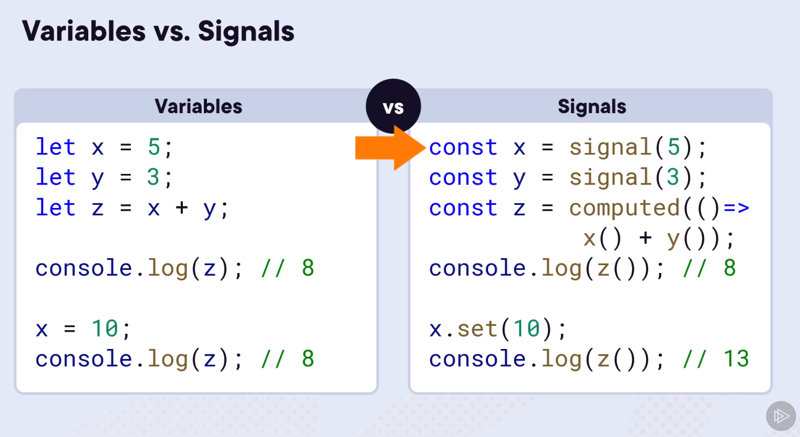

# Signal

+ `Signal = dataValue + change notification.`
+ “`signal”` is like a box that holds a value. This box can tell other parts of your program when the value inside it changes.
+ It is new way for our code to tell our templates that data changed.
+ important for improved change detection



## Types of signals

### Writable Signals

These are signals where you can change the value inside the box. For example, if you have a box holding the number of apples you have, you can increase or decrease this number.

```ts
// Signals are getter functions - calling them reads their value.
const count = signal(0);  
console.log('The count is: ' + count()); // Output: The count is: 0

// replace the value
count.set(3);

// Update value based on current value
count.update(value => value + 1); // Increment the count by 1.
```

### Computed Signals

`computed()` signal is signal that calculate their value based on other signals.  
For example, if you have a box with the number of apples and another box with the number of oranges, you can have a computed signal that always knows the total number of fruits you have.

```ts
let apples = signal(5); 

let totalFruits = computed(() => apples() * 2); 
```

## Effect signal

+ `effect()` signal is a function that triggers when a signal value changes.
+ It’s a way to create side effects in your application that run whenever one or more signal values change.

```ts
import { signal, effect } from 'angular';

// This is a writable signal that represents the count.
const count = signal(0);

// This is an effect that logs the current count whenever it changes.
effect(() => {
  console.log(`The current count is: ${count()}`);
});

// This is a function that increments the count.
function increment() {
  count.update(value => value + 1);
}

// Call the increment function a few times.
increment();
increment();
increment();
```

## Examples

+ **Signals can contain any value, from simple primitives to complex data structures1.**

```ts
quantity = signal(1);
qtyAvailable = signal([1, 2, 3, 4, 5, 6]);
selectedVehicle = signal<Vehicle>({ id: 1, name: 'AT-AT', price: 19416.13 });
vehicles = signal<Vehicle[]>([]);
```
